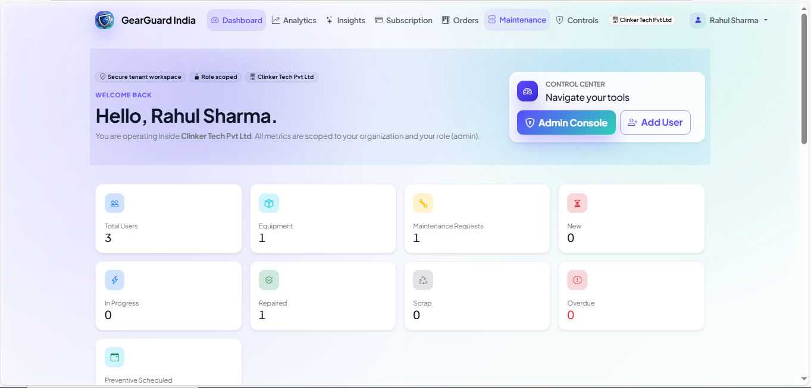
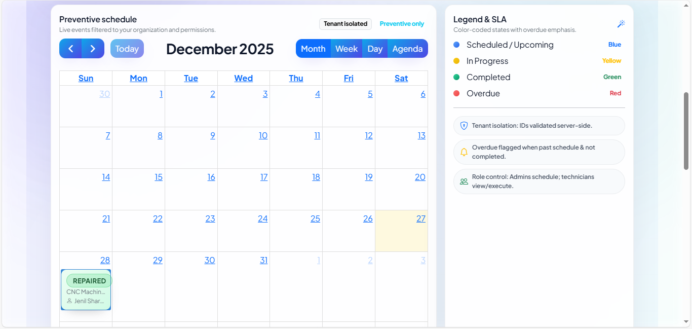
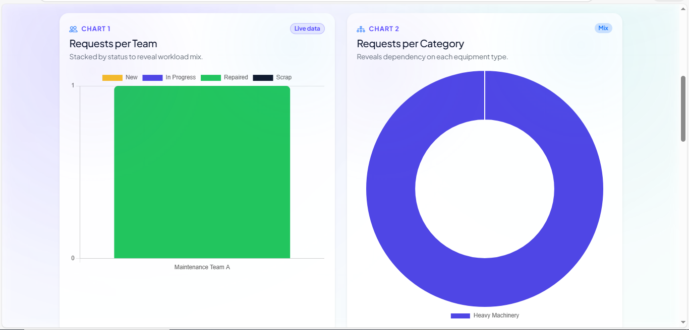
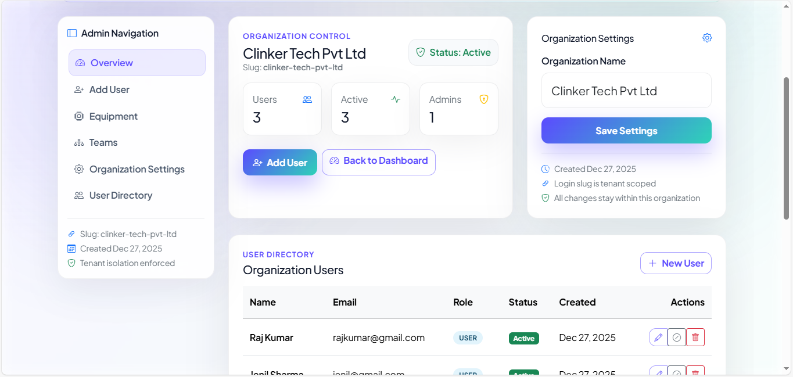

**GearGuard India** — AI-assisted maintenance operations for multi-tenant organizations. Centralizes equipment, teams, maintenance requests, analytics, and billing with role-based governance, OTP security, and optional AI guidance.

---

## Table of Contents
- [1. Title and One-Line Summary](#1-title-and-one-line-summary)
- [2. Professional Description](#2-professional-description)
- [3. Live Demo and Video](#3-live-demo-and-video)
- [4. Screenshots](#4-screenshots)
- [5. Features](#5-features)
- [6. System Architecture](#6-system-architecture)
- [7. Tech Stack](#7-tech-stack)
- [8. Installation](#8-installation)
- [9. Environment Variables](#9-environment-variables)
- [10. API Documentation](#10-api-documentation)
- [11. Usage Guide](#11-usage-guide)
- [12. Business Logic](#12-business-logic)
- [13. Database and Models](#13-database-and-models)
- [14. Performance and Scalability](#14-performance-and-scalability)
- [15. Security and Permissions](#15-security-and-permissions)
- [16. Testing](#16-testing)
- [17. Known Issues and Limitations](#17-known-issues-and-limitations)
- [18. Roadmap](#18-roadmap)
- [19. Contribution Guide](#19-contribution-guide)
- [20. License](#20-license)
- [21. Credits](#21-credits)

## 1. Title and One-Line Summary
**GearGuard India** — Multi-tenant CMMS-style maintenance platform with equipment, teams, preventive and corrective workflows, Kanban and calendar views, AI helpers, and embedded billing.

## 2. Professional Description
GearGuard India streamlines maintenance operations for equipment-heavy organizations. It isolates data per tenant, enforces OTP-backed authentication, and gives admins tools to run teams, schedule preventive work, triage breakdowns, and track subscriptions. Technicians use Kanban, calendar, and smart actions to execute work. A root-level super admin governs tenants, users, and billing. Optional Hugging Face models add request summarization, technician suggestions, and risk insights without external APIs.

**Who uses it**: Plant managers, maintenance leads, technicians, MSPs, and platform operators.

**Outcomes**: Faster triage, clearer ownership, tracked SLAs, controlled access, and subscription-aware scaling.

## 3. Live Demo and Video
Demo Video: https://drive.google.com/drive/folders/1okU-05nLeh0sXgt3KC67wS0tXe9oD-w_?usp=drive_link

## 4. Screenshots
Current demo captures (see `demo-image/`):


Dashboard overview with KPIs and recent activity.


Maintenance list and filters.


Request detail with status, team, and technician context.


Analytics for status mix, categories, trends, and team performance.


Administrative controls and navigation.

## 5. Features
- **Multi-tenant isolation**: Tenant context enforced on every query; cross-tenant access blocked via guards and session checks.
- **Authentication and OTP**: Email/password with OTP for login/registration/reset; super admin OTP for root access; lockout and rate-limit protections.
- **Roles and permissions**: Tenant Admin (full org control), Technician/User (scoped to their teams/requests), Super Admin (platform-wide governance).
- **Equipment management**: CRUD with uniqueness per org, status (active/maintenance/out_of_service/scrapped), serial validation, team/technician assignment, overdue indicators from related requests.
- **Team management**: Create teams, add/remove technicians, view equipment and workload counts per team.
- **Maintenance requests**: Corrective and preventive types, priorities, scheduling, technician assignment, smart actions (assign/start/repair/scrap), duration capture, overdue detection.
- **Kanban board**: JSON-backed Kanban with drag-and-drop transitions and permission-aware moves; auto-assign on execution states.
- **Preventive calendar**: List and create preventive events via API; reschedule with validation; calendar feeds filtered by date window.
- **AI assistance (local HF)**: Optional description enhancement, technician recommendation, and predictive maintenance heuristics with JSON fallbacks when the model is unavailable.
- **Analytics**: Dashboard counts, request breakdowns, category trends, completion ratios, team performance, overdue stats.
- **Subscriptions and billing (Razorpay)**: Seat-based capacity, trials, upgrade calculations, checkout, signature verification, webhooks, email notifications, and super admin override controls.
- **Support intake**: Public support form with rate limiting and email notification.
- **Email alerts**: SMTP-backed OTP, password reset, maintenance events, subscription events, and security alerts with console fallback for dev.
- **Super admin console**: Manage org lifecycle (activate/suspend/delete), force subscription states, adjust seats, reset users, and review security events.
- **Security layer**: CSRF protection, strong password validation, session security headers, brute-force limits, and audit events.

## 6. System Architecture
- **Backend**: Flask app factory with blueprints (`main`, `admin`, `dashboard`, `super_admin`) and global extensions (SQLAlchemy, WTForms CSRF, LoginManager, Flask-Migrate).
- **Frontend**: Jinja templates with Bootstrap 5, Bootstrap Icons, and vanilla JS assets under `static/js` (e.g., Kanban interactions, spinners).
- **Database**: SQLAlchemy ORM models with tenant-scoped foreign keys. SQLite by default; PostgreSQL/MySQL via `DATABASE_URL`/`DATABASE_URI`.
- **AI path**: Local Hugging Face pipeline (`HF_MODEL_NAME`, default `google/flan-t5-small`) for text2text or text-generation; fallback heuristics for resilience.
- **Billing path**: Razorpay orders from `/admin/subscription/checkout`, signature verification at `/admin/subscription/verify`, webhooks at `/admin/subscription/webhook`.
- **Request flow**: Auth → tenant context set → role check → view/controller → ORM → templates/JSON → email notifications.

### Flow (textual)
Client request → Flask route → tenant/session guard → business logic and validation → database read/write → optional AI/billing/email side-effects → JSON or HTML response.

## 7. Tech Stack
- Python 3.11+, Flask 2.x, Flask-WTF, Flask-Login, Flask-Migrate, SQLAlchemy
- Jinja2, Bootstrap 5, Bootstrap Icons, vanilla JavaScript
- Razorpay Python SDK
- Hugging Face Transformers, Torch (optional, local inference)
- SQLite (default), PostgreSQL/MySQL compatible

## 8. Installation
1) **Prerequisites**: Python 3.11+, Git, virtualenv; SQLite included. For AI, ensure the HF model is available locally (or allow download).
2) **Clone**
	 ```bash
	 git clone https://github.com/shahram8708/GearGuard-India
	 cd GearGuard India
	 ```
3) **Create virtualenv (Windows)**
	 ```bash
	 python -m venv .venv
	 .venv\Scripts\activate
	 ```
4) **Install dependencies**
	 ```bash
	 pip install --upgrade pip
	 pip install -r requirements.txt
	 ```
5) **Configure environment**: Copy `.env` template from below and set secrets/keys.
6) **Initialize database**: First run auto-creates tables; for existing migrations, set `RUN_DB_UPGRADE_ON_START=true` to auto-upgrade.
7) **Run server**
	 ```bash
	 python run.py
	 ```
	 App serves at http://localhost:5000.

## 9. Environment Variables
- `SECRET_KEY` — Flask secret; required in production.
- `APP_ENV` / `FLASK_ENV` — `development` or `production` (controls config class).
- `DATABASE_URL` or `DATABASE_URI` — SQLAlchemy DSN (e.g., `postgresql://...`). Falls back to `DATABASE_PATH` SQLite file.
- `DATABASE_PATH` — Relative/absolute path for SQLite DB (default `instance/GearGuard India.db`).
- `RUN_DB_UPGRADE_ON_START` — Auto-apply migrations on boot.
- `BOOTSTRAP_DEMO_DATA` — Seed demo org/users/equipment/requests.
- **Session/Security**: `SESSION_COOKIE_SECURE`, `SESSION_LIFETIME_HOURS`, `LOGIN_MAX_FAILURES`, `OTP_EXPIRY_MINUTES`, `OTP_MAX_ATTEMPTS`, `OTP_RESEND_COOLDOWN_SECONDS`, `OTP_MAX_PER_HOUR`.
- **Super Admin**: `SUPERADMIN_EMAIL`, `SUPERADMIN_PASSWORD` or `SUPERADMIN_PASSWORD_HASH`, `SUPERADMIN_NAME`, `SUPERADMIN_ORG_SLUG`, `SUPERADMIN_OTP_*`, `SUPERADMIN_LOGIN_*`, `SUPERADMIN_ALERT_EMAIL`, `SUPERADMIN_RATE_LIMIT_PER_IP`, `SUPERADMIN_RATE_LIMIT_WINDOW_MINUTES`.
- **Mail**: `MAIL_SMTP_HOST`, `MAIL_SMTP_PORT`, `MAIL_SMTP_USERNAME`, `MAIL_SMTP_PASSWORD`, `MAIL_USE_TLS`, `MAIL_USE_SSL`, `MAIL_CONSOLE_FALLBACK`, `MAIL_SENDER`.
- **AI**: `HF_MODEL_NAME`, `HF_LOCAL_ONLY`, `HF_ENABLE_CUDA`, `AI_MAX_NEW_TOKENS`, `AI_NUM_BEAMS`, `AI_ENABLE_FALLBACK`.
- **Billing**: `RAZORPAY_KEY_ID`, `RAZORPAY_KEY_SECRET`, `RAZORPAY_WEBHOOK_SECRET`, `SUBSCRIPTION_TRIAL_SEATS`, `SUBSCRIPTION_BASE_FEE_INR`, `SUBSCRIPTION_PER_MEMBER_INR`, `SUBSCRIPTION_CURRENCY`.
- **Misc**: `ASSET_VERSION`, `PREFERRED_URL_SCHEME`, `TRUSTED_PROXY_COUNT`, `USE_PROXY_FIX`, `MAX_CONTENT_LENGTH`.

## 10. API Documentation
HTML views return rendered pages; several endpoints also expose JSON for UI widgets.

- **Auth & OTP** (main blueprint)
	- `POST /login` — Email/password; issues OTP for registration/login; sets tenant session.
	- `POST /verify-otp` — Verifies OTP for login/registration/reset; marks email verified.
	- `POST /forgot-password` → `POST /reset-password` — Issues and validates reset token.
- **Equipment** (admin)
	- `GET /admin/equipment` — List/filter/paginate equipment.
	- `POST /admin/equipment` (form) — Create equipment with team/user assignment.
	- `POST /admin/equipment/<id>/ai/predict` — JSON predictive recommendation for an asset.
- **Teams & Technicians** (admin)
	- `GET /admin/teams` — List teams with member/equipment counts.
	- `POST /admin/teams/<id>/technicians` — Add technician to team; enforce tenant membership.
- **Maintenance** (admin)
	- `GET /admin/maintenance` — Filtered list (status, type, overdue, team/equipment).
	- `POST /admin/maintenance` — Create corrective/preventive request; validates preventive schedule.
	- `GET /admin/maintenance/<id>` — Request detail (HTML).
	- `POST /admin/maintenance/<id>/ai/recommend-technician` — JSON suggestion using history/workload.
	- `POST /admin/maintenance/<id>/assign` — Assign technician; starts work when new.
	- `POST /admin/maintenance/<id>/transition` — Move through lifecycle with guards.
	- `POST /admin/maintenance/<id>/smart-action` — JSON smart actions (assign_me/start/repaired/scrap).
	- **Kanban**: `GET /admin/maintenance/kanban` (HTML) and `GET /admin/maintenance/kanban/data` (JSON); `POST /admin/maintenance/kanban/<id>/move` moves cards.
	- **Calendar**: `GET /admin/maintenance/calendar/events` (preventive feed), `POST /admin/maintenance/calendar` create, `PATCH /admin/maintenance/calendar/<id>/reschedule` update, `GET /admin/maintenance/calendar/<id>` detail.
- **Analytics & AI** (dashboard)
	- `GET /dashboard` — Metrics, charts, recent requests.
	- `GET /dashboard/analytics` — Aggregations by team, category, trend; CSV export via `?export=csv`.
	- `GET /dashboard/ai-insights` — AI-generated risk/ops panels.
- **Billing** (admin)
	- `GET /admin/subscription` — Subscription overview.
	- `POST /admin/subscription/checkout` — Create Razorpay order; returns JSON.
	- `POST /admin/subscription/verify` — Verify signature and activate subscription.
	- `POST /admin/subscription/webhook` — Razorpay webhook (signature-verified, CSRF-exempt).
- **Super Admin** (root)
	- `GET /root/` — Platform overview.
	- `POST /root/organizations/<id>/action` — Activate/suspend/delete, extend trial, increase capacity, force subscription.
	- `POST /root/users/<id>/action` — Activate/deactivate/promote/demote/force reset.
	- `GET /root/security` — View recent security events.

Responses are HTML unless noted; JSON endpoints return `message` plus payload objects.

## 11. Usage Guide
- **Create organization and admin**: Use signup flow or seed demo with `BOOTSTRAP_DEMO_DATA=true`. Login via `/login` with org slug and email/password; complete OTP.
- **Add users**: Admins go to Admin → Users to add manually or upload CSV (name,email,password,role). Quotas enforced by subscription.
- **Create teams**: Admin → Teams → New; add technicians via team page.
- **Register equipment**: Admin → Equipment → Add; set team and optional assigned technician; statuses reflect lifecycle.
- **Raise maintenance request**: Admin/Users → Maintenance → New; choose corrective or preventive, set equipment and priority. Preventive requires a scheduled date.
- **Use Kanban**: Admin/Technician → Maintenance Kanban; drag cards across statuses. Permissions guard moves; auto-assign when entering execution states.
- **Use calendar**: Preventive events appear on the calendar; create via UI or `POST /admin/maintenance/calendar`; reschedule via PATCH endpoint.
- **Assign technicians**: From request detail, admins or team technicians can assign; assignment starts work if status is New.
- **Complete or scrap**: Transition to Repaired or Scrap from detail, smart action, or Kanban move; duration auto-computed.
- **Analytics**: Visit `/dashboard/analytics` for team/category trends, completion ratios, and performance; export CSV if needed.
- **Billing**: Admins open `/admin/subscription`, choose seats, create Razorpay order, and verify payment; webhook can sync state.
- **Super admin operations**: Root login (super admin email + password + OTP) to manage orgs/users/security globally.

## 12. Business Logic
- **Request lifecycle**: `NEW` → `IN_PROGRESS` → `REPAIRED` → `SCRAP`. Guards prevent invalid transitions; repairs and scrap record completion timestamps and durations.
- **Preventive validation**: Preventive requests require `scheduled_date` both in forms and ORM guards; calendar creation blocks past dates.
- **Auto-context**: On request creation/update, equipment category snapshot is stored; team/technician inferred from equipment when missing.
- **Overdue logic**: Any scheduled request not repaired/scrapped and scheduled before today is marked overdue; used in dashboards and indicators.
- **Smart actions**: `assign_me`, `start`, `repaired`, `scrap` respect team membership and roles; auto-assign technician when starting or moving via Kanban.
- **Technician workload**: Workload snapshots count open items and average duration; AI uses this to suggest assignments.
- **Subscription gates**: User creation enforces seat limits; upgrades compute incremental seats and optional base fee; payments captured before activating.
- **Email/OTP**: OTP reuse invalidated on issuance; attempts and cooldown enforced; rate limits for support and super admin login.

## 13. Database and Models
- `Organization` (status, slug, subscription, users)
- `User` (role, active, email_verified, login lockout, reset tokens, org FK)
- `MaintenanceTeam` / `TechnicianMembership`
- `Equipment` (status, team/user assignment, unique name/serial per org)
- `MaintenanceRequest` (status, type, priority, schedule, duration, team/technician links, overdue property)
- `OrganizationSubscription` and `PaymentHistory` (Razorpay order/payment tracking, seat capacity, status)
- `EmailOtp` / `SuperAdminOtp` (purpose, expiry, attempts, client fingerprint)
- `SecurityEvent` (audit log for auth, super admin, and platform actions)
- `SupportRequest` (public support intake with optional org/user)

## 14. Performance and Scalability
- Uses SQLAlchemy with `pool_pre_ping` and configurable pool recycle; suitable for small/medium orgs.
- Eager loading (`joinedload`) on heavy views (maintenance lists, kanban) to reduce query count.
- AI runs locally; model load is heavyweight—pre-download models or disable AI in constrained environments.
- SQLite default is best for demos; use PostgreSQL/MySQL for concurrent writes and production durability.
- No background workers; email and AI run inline—consider offloading for higher throughput.

## 15. Security and Permissions
- CSRF protection via Flask-WTF; security headers set post-request.
- Strong password validation (length, case, digit, symbol) and login failure lockouts.
- Tenant checks on every sensitive route; guards prevent cross-organization relations.
- OTP for login/registration/reset and super admin access; rate limits for OTP and support form.
- Roles enforced with decorators: Admin for org management; technicians limited to their requests/teams; super admin bypasses tenant scope for governance only.

## 16. Testing
Automated tests are not included. Recommended manual checks:
- Create org, user, login with OTP
- CRUD equipment/teams
- Create preventive and corrective requests; move through lifecycle; verify duration capture
- Kanban drag-and-drop and smart actions permissions
- Calendar create/reschedule
- Subscription checkout/verify (use Razorpay test keys)
- AI endpoints with and without local model available

## 17. Known Issues and Limitations
- No automated test suite; manual regression needed.
- AI model load can be slow and requires local model availability; fallback heuristics used when unavailable.
- Email delivery depends on SMTP configuration; console fallback is dev-only.
- SQLite not suited for high-concurrency production; migrate to PostgreSQL/MySQL.
- No background job runner; long-running email/AI/billing calls block request.

## 18. Roadmap
- Add Celery/RQ worker for email and AI tasks.
- Add migration scripts and CI test suite.
- Expand REST API coverage for external integrations (mobile/IoT gateways).
- Add file attachments on maintenance requests (photos, manuals).
- SLA tracking (target vs actual, breach alerts).
- Webhook consumers for external CMMS/ERP sync.

## 19. Contribution Guide
- Fork and create feature branches from `main`.
- Keep tenant isolation and role checks intact; include screenshots for UI changes.
- Add or update migration scripts when touching models; avoid committing secrets.
- Use PEP 8 formatting; prefer joinedload for N+1 prone views.
- Open a PR with clear description, repro steps, and any manual test notes.

## 20. License
MIT License. See LICENSE for full text.

## 21. Credits
- Hackathon team behind GearGuard India.
- Open-source maintainers of Flask, SQLAlchemy, Bootstrap, Razorpay SDK, and Hugging Face Transformers.
- Early users who provided operational feedback.
